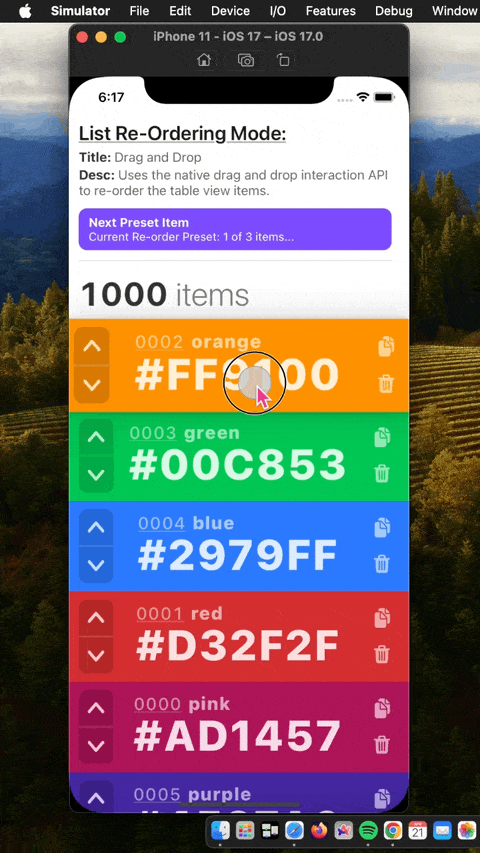

# react-native-ios-list-view

An experimental component for using `UITableView` (and eventually `UIColletionView`) in `react-native`.

  

## Demo/Test Gifs + Description

| Gif                                                          | Description                                                  |
| ------------------------------------------------------------ | ------------------------------------------------------------ |
|    | **Component**: [TableViewTest02Screen](example/src/examples/TableViewTest02Screen/TableViewTest02Screen.tsx)  **Desc**: 1️⃣. This gif shows a `UITableView` using react components for the cell content.  2️⃣. Shows using an "array of JS objects" prop as the `UITableViewDataSource` for the table view.  3️⃣  Shows re-ordering the `UITableView` rows via the the iOS 11+  [drag & drop API](https://developer.apple.com/documentation/uikit/drag_and_drop) (i.e. `UITableViewDragDelegate`, `UITableViewDropDelegate`).  4️⃣. Shows a `UITableView` with self-sizing cells.  5️⃣. Shows `UITableView`'s cell re-use logic reusing the react components (i.e. the timer and counter state is preserved across rows, but the cell content changes).   |
|        | **Component**: [TableViewTest03Screen](example/src/examples/TableViewTest03Screen/TableViewTest03Screen.tsx)  **Desc**: This gif shows programmatically moving the `UITableView` rows up and down via calling a module command. |
|     | **Component**: [TableViewTest02Screen](example/src/examples/TableViewTest02Screen/TableViewTest02Screen.tsx)  **Desc**: 1️⃣. This gif shows changing which API to use to re-order the rows (i.e. drag and drop interaction, and `UItableView.isEditing` mode).  2️⃣. Shows table row reordering via `UITableView.isEditing` mode + using the standard re-ordering control to drag and move the rows.  3️⃣. Shows table row reordering via `UITableView.isEditing` mode + using a custom react component for the re-ordering control (e.g. the color hex title container).  4️⃣. Shows table row reordering via the iOS 11+ drag and drop API (i.e. `UITableViewDragDelegate`, and `UITableViewDropDelegate`).   |

